# 🏛️ Arquitectura de la Aplicación

Este documento detalla la arquitectura técnica completa de la aplicación de red social, incluyendo diagramas de flujo de datos, estructura de componentes y patrones de diseño implementados.

## 📊 Diagrama de Arquitectura General

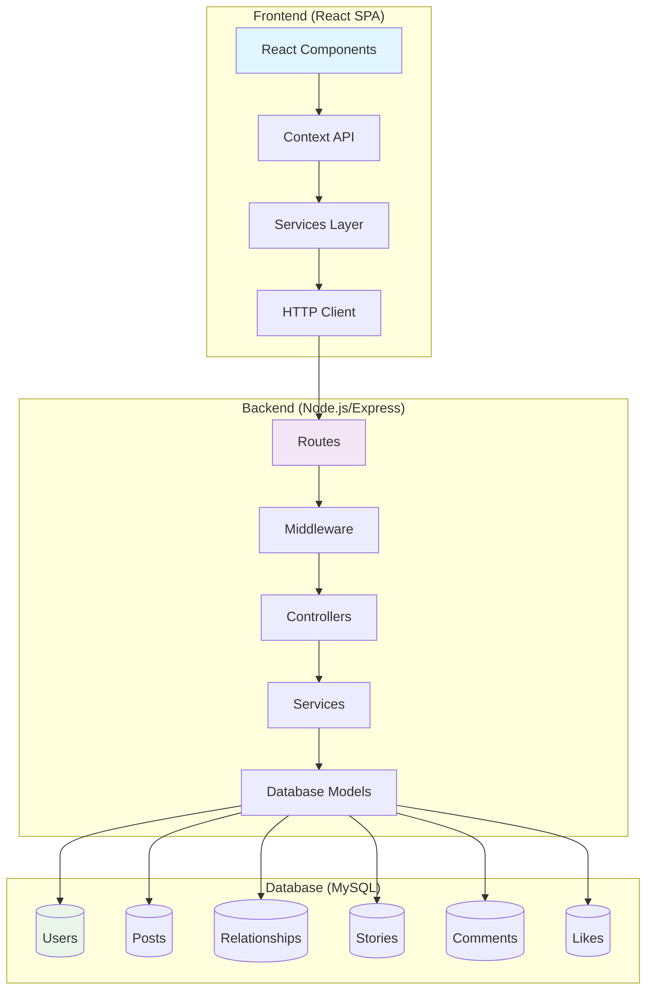

## 🔄 Flujo de Autenticación

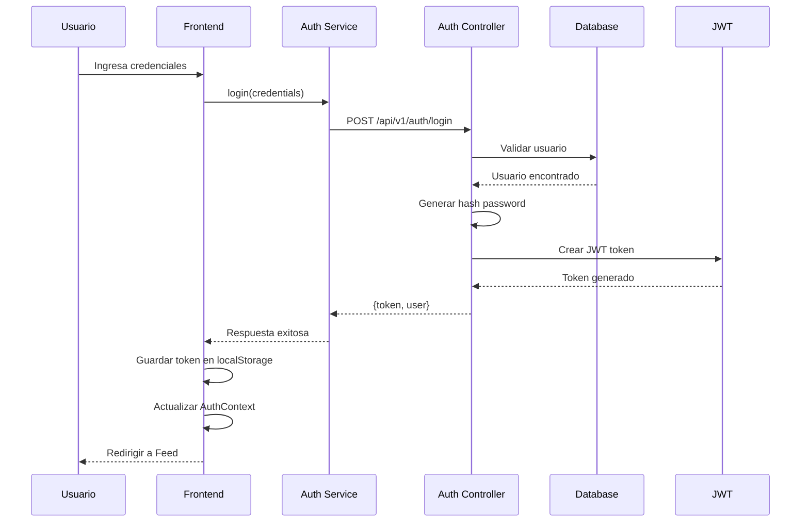

## 📱 Flujo de Creación de Posts

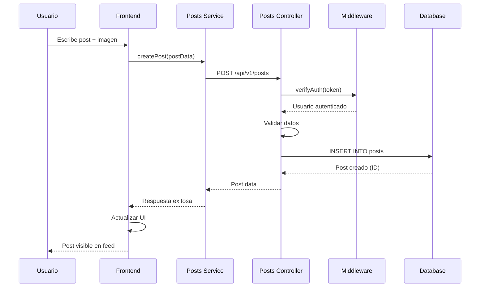

## 🗂️ Estructura de Componentes Frontend

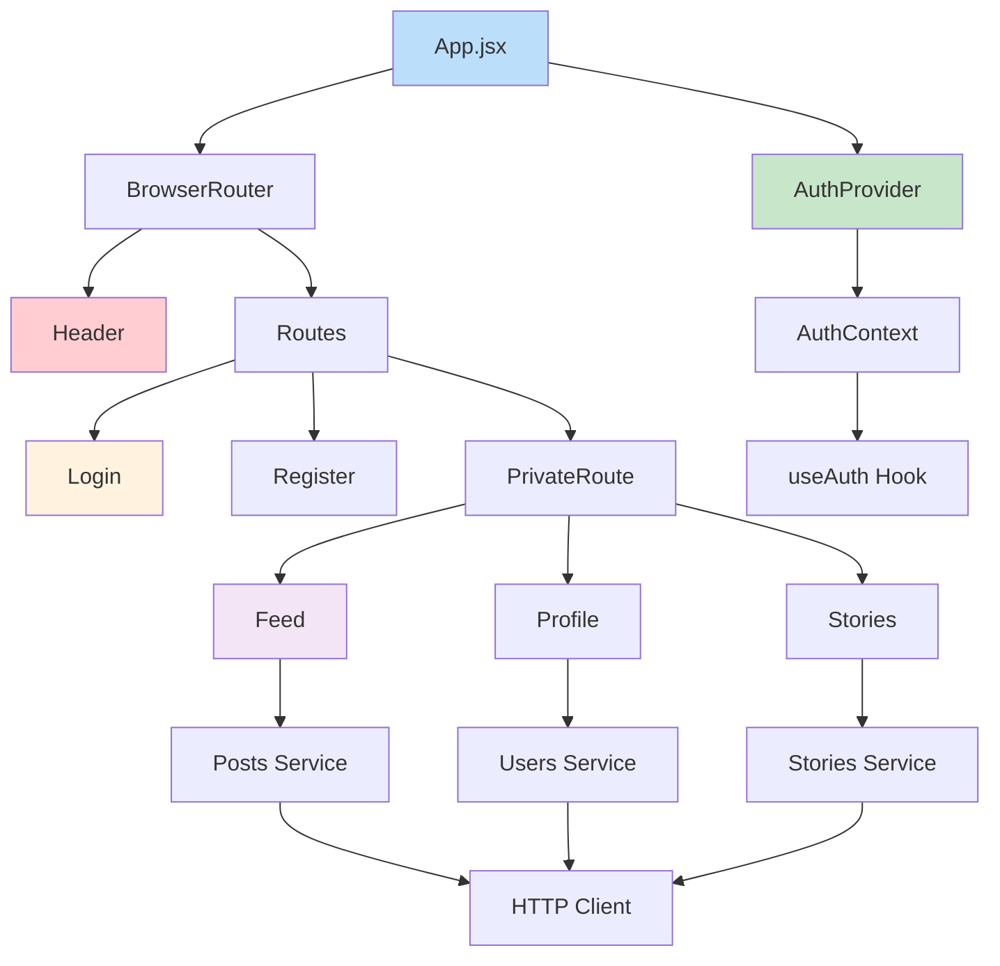

## 🛠️ Arquitectura de Backend

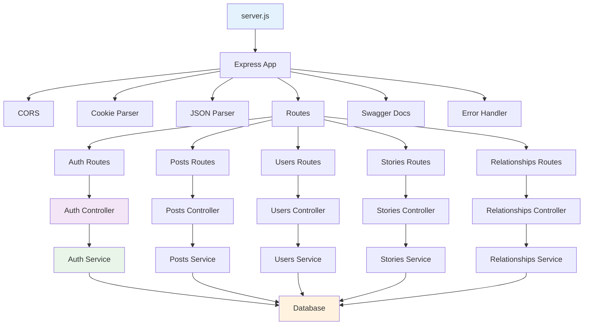

## 💾 Modelo de Datos Relacional

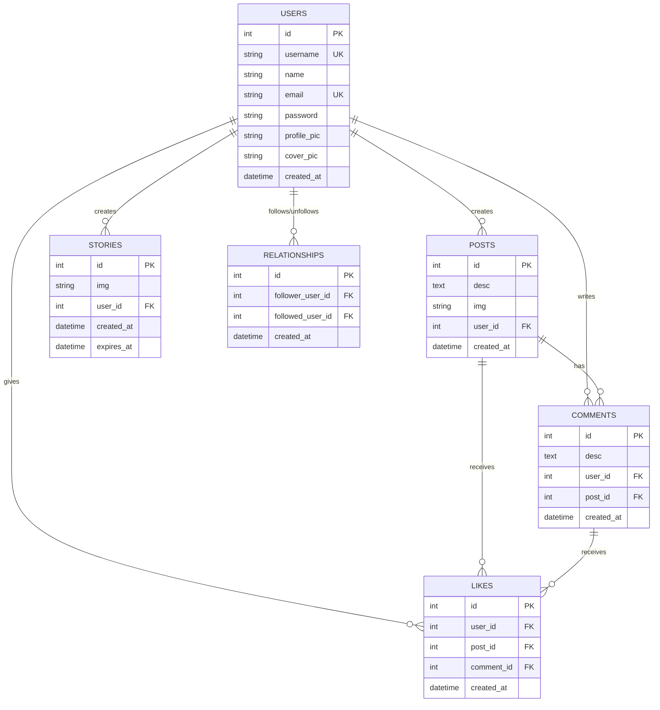

## 🔐 Arquitectura de Seguridad

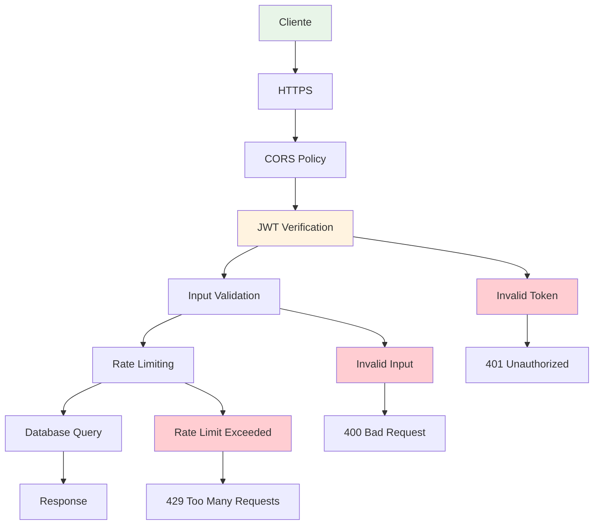

## 🧪 Arquitectura de Testing

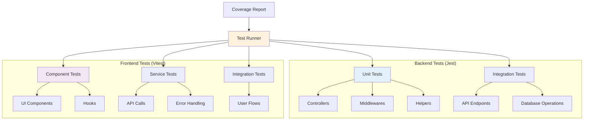

## 🚀 Arquitectura de Despliegue

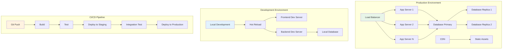

## 📡 API Endpoints Architecture

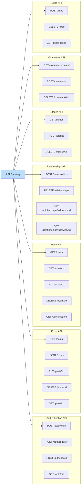

## 🔄 Data Flow Patterns

### Patrón Repository
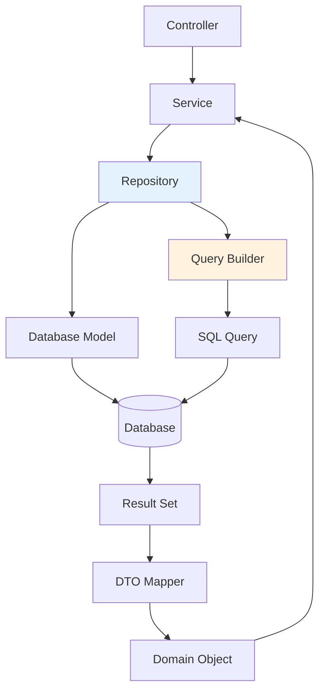

### Patrón Observer (Context API)
```mermaid
graph TD
    A[AuthContext] --> B[Login Action]
    A --> C[Logout Action]
    A --> D[Token Update]

    B --> E[Update State]
    C --> E
    D --> E

    E --> F[Notify Subscribers]
    F --> G[Header Component]
    F --> H[Protected Routes]
    F --> I[API Service]

    G --> J[Show User Menu]
    H --> K[Render/Redirect]
    I --> L[Add Auth Headers]

    style A fill:#bbdefb
    style E fill:#ffcdd2
```

## 📈 Escalabilidad Considerations

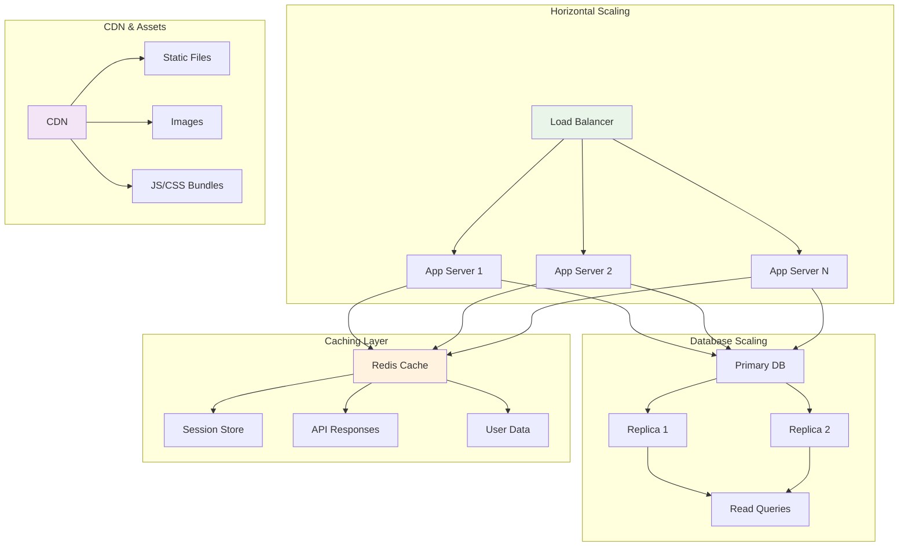

## 🔧 Development Workflow

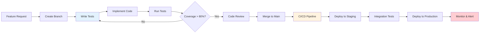

Esta arquitectura proporciona una base sólida y escalable para la aplicación de red social, siguiendo mejores prácticas de desarrollo moderno y patrones de diseño probados.